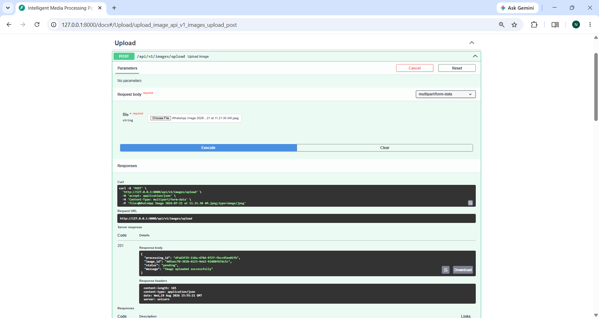
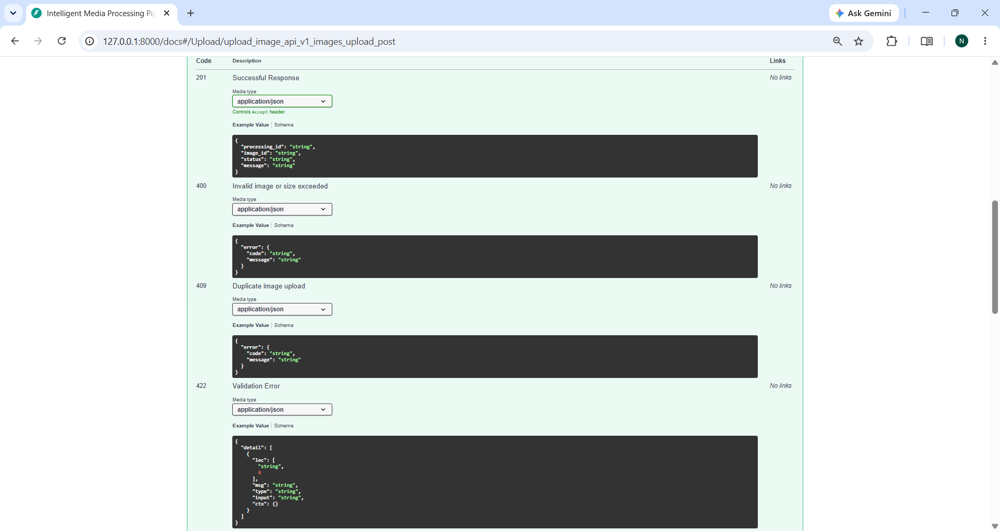
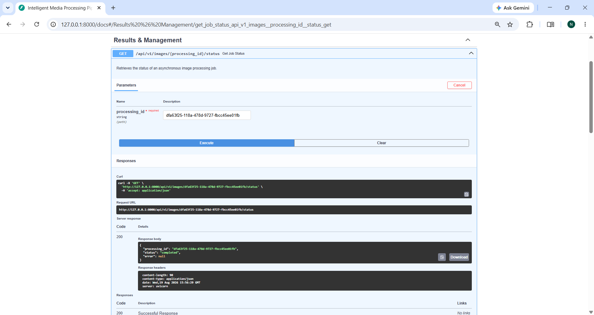
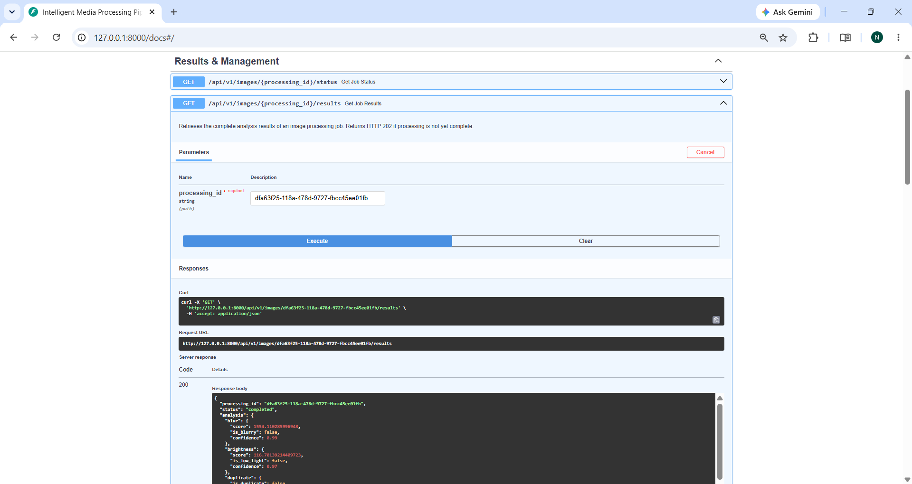
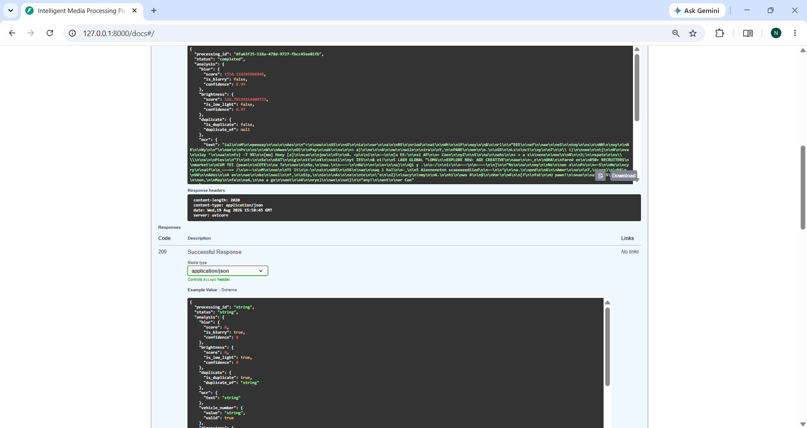
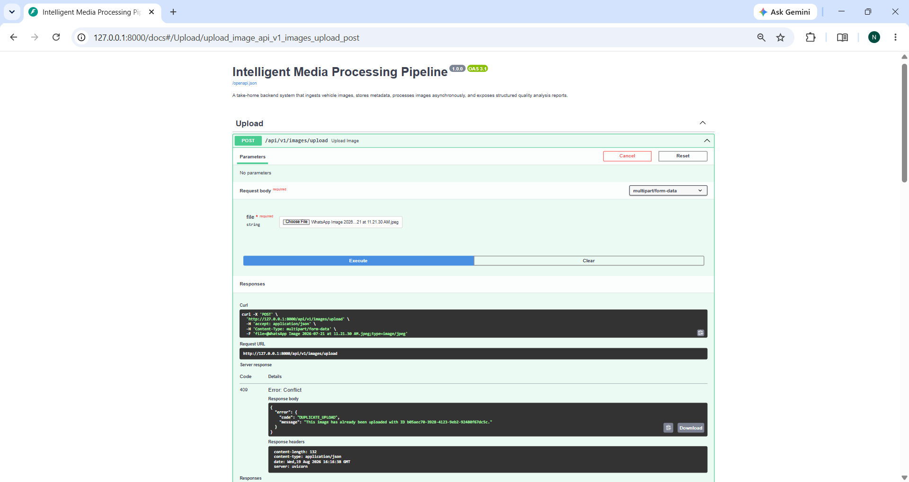
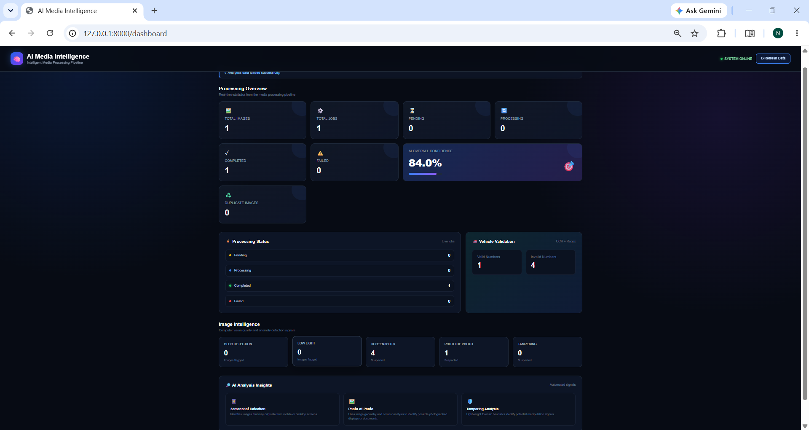
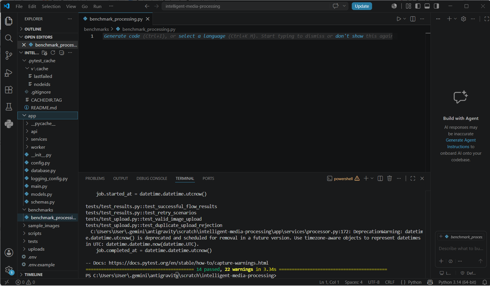

# Intelligent Media Processing Pipeline

## 1. Overview
The **Intelligent Media Processing Pipeline** is a complete, modular, and asynchronous backend system designed to ingest, validate, and analyze vehicle images. It implements a local background-job queue to process files asynchronously, running checks for image quality (blur and brightness), file uniqueness (duplicate hash checks), text extraction (OCR), and heuristic-based anomaly detection (screenshots, photos-of-photos, and tampering). 

This system acts as a robust prototype for production environments that handle high-throughput image uploads, where heavy processing tasks must be decoupled from the HTTP request-response cycle to prevent blocking clients.

---

## 2. Features
- **Asynchronous Processing**: Immediate REST response on upload, offloading heavy CPU-bound image analysis to a local background worker thread.
- **Image Quality Checks**:
  - **Blur Detection**: Calculates the variance of the Laplacian using OpenCV.
  - **Brightness Detection**: Calculates the mean intensity of the grayscale representation.
- **Uniqueness checks**:
  - **Exact Duplicate Rejection**: Computes SHA-256 hashes on upload and rejects identical files with `409 Conflict`.
  - **Perceptual Similarity**: Implements a Difference Hash (`dhash`) calculation for visual similarity analysis.
- **Indian Vehicle Plate Recognition**:
  - Preprocesses images (grayscale, scale resizing, Otsu's thresholding) to improve OCR recognition.
  - Performs text extraction via `pytesseract` (gracefully falling back to `"OCR_UNAVAILABLE"` if the Tesseract binary is missing).
  - Normalizes and validates Indian registration number formats (e.g. `KA01AB1234`) using standard regex patterns.
- **Lightweight Heuristics (Uncertainty-safe)**:
  - **Screenshot Detection**: Checks for screen resolution aspect ratios and filename patterns.
  - **Photo-of-photo Detection**: Uses Canny edge detection and contour approximation to identify nested rectangular boundaries (like screen bezels or printed paper edges).
  - **Tampering Detection**: Implements basic Error Level Analysis (ELA) to detect JPEG resaving quality deviations and checks EXIF software tags (e.g. Photoshop).
- **Manual & Automatic Retries**: Automatically retries failed worker jobs up to 3 times, and exposes a POST retry API endpoint for manual recovery of failed jobs.
- **Comprehensive API Error Handling**: Custom handlers formatting system exceptions and validation errors into structured, client-safe error payloads.
- **Health Check & API Documentation**: Integrated `/health` status check and `/docs` interactive Swagger UI.
- **Analytics Dashboard (Bonus)**: Provides aggregated processing statistics through `GET /api/v1/analytics/summary`, including job status counts, quality issues, vehicle validation statistics, and average confidence.
- **Web Dashboard UI (Bonus)**: A responsive HTML/CSS/JavaScript dashboard served at `/dashboard`, displaying live analytics with a manual refresh option.

---

## 3. Architecture
The system is built on a clean, decoupled architecture:
- **FastAPI**: Handles HTTP requests, input validation, and API routing.
- **SQLAlchemy ORM + SQLite**: Ingests metadata and persists analysis metrics in three relational tables.
- **In-Memory Thread-safe Queue**: Orchestrates jobs using a queue manager backed by a daemon worker thread.

```
                  +-----------------------+
                  |      HTTP Client      |
                  +-----------+-----------+
                              |
                              |  (1) Upload / Get status
                              v
                  +-----------+-----------+
                  |  FastAPI REST Server  |
                  +-----+-----------+-----+
                        |           |
       (2) Ingest metadata /        |  (3) Enqueue job ID
       Query results                |
                        v           v
           +------------+---+   +---+------------+
           |  SQLite / ORM  |   |  Job Queue     |
           +------------+---+   +---+------------+
                        ^           |
       (5) Persist results          |  (4) Read job ID
                        |           v
           +------------+-----------+------------+
           |       Background Worker Thread      |
           +--------------------+----------------+
                                |
                                | Run orchestrator
                                v
           +--------------------+----------------+
           |       Image Analysis Services       |
           |  - Blur            - OCR            |
           |  - Brightness      - Vehicle Plate  |
           |  - Duplicates      - Dimensions     |
           |  - Heuristics (Screenshot, etc.)    |
           +-------------------------------------+
```

---

## 4. Processing Flow
1. **Upload Phase**:
   - Client sends image via `POST /api/v1/images/upload`.
   - Backend validates the MIME type and file extension.
   - Saves file under `uploads/` using a server-side generated UUID filename to prevent path traversal or execution attacks.
   - Asserts file size limit (10MB) and decodability (using Pillow).
   - Computes SHA-256 hash. If duplicate, returns `409 Conflict`.
   - Records metadata in `images` table and inserts a `pending` status record in `processing_jobs`.
   - Submits the job UUID to the in-memory queue and immediately returns HTTP 201 to the client.
2. **Worker Processing Phase**:
   - Background worker retrieves the job ID.
   - Marks the job as `processing` and sets `started_at` in the DB.
   - Executes individual checkers (Blur, Brightness, OCR, Vehicle Regex, Dimensions, Heuristics).
   - Computes a combined, heuristic-based `overall_confidence` score.
   - Saves the metrics into the `analysis_results` table, updates the job status to `completed`, and records `completed_at`.
   - If an exception occurs, the worker increments the `retry_count`, resets the job to `pending`, and re-queues it (up to 3 times total). If retries are exhausted, the job status is set to `failed` and the exception traceback is logged internally.

---

## 5. Technology Stack
- **Python 3.11+**: Modern language capabilities, strong type hints, and standard library concurrency modules.
- **FastAPI**: Exceptionally fast, async-native ASGI web framework that auto-generates interactive Swagger API schemas.
- **Uvicorn**: Lightweight, lightning-fast ASGI web server.
- **SQLite**: Serverless relational database, perfect for local prototyping and zero-configuration setups.
- **SQLAlchemy ORM**: Prevents SQL injection, simplifies schema relations, and makes switching to PostgreSQL/MySQL trivial.
- **OpenCV & NumPy**: High-performance C++-backed operations for Laplacian variance, gray scale conversion, and Canny edges.
- **Pillow (PIL)**: Standard library for loading, verifying, and generating image formats.
- **Pytesseract**: Simple python interface wrapper for Tesseract OCR.
- **pytest**: Clean, modular testing suite.

---

## 6. Project Structure
```
intelligent-media-processing/
│
├── app/
│   ├── __init__.py
│   ├── main.py               # FastAPI application setup, lifecycle, and error handlers
│   ├── config.py             # Configuration loader via Pydantic settings
│   ├── database.py           # Database connection, ORM base, and sessionmaker
│   ├── models.py             # SQLAlchemy models (Images, Jobs, AnalysisResults)
│   ├── schemas.py            # Pydantic schema validation & response models
│   ├── logging_config.py     # Structured logger with job-ID formatting
│   │
│   ├── api/
│   │   ├── __init__.py
│   │   ├── upload.py         # Upload REST routing and file validation
│   │   ├── results.py        # Status, results retrieval, and manual retry routing
│   │   └── analytics.py      # Aggregated processing and quality analytics
│   │
│   ├── services/
│   │   ├── __init__.py
│   │   ├── processor.py      # Job execution orchestration & automated retry controller
│   │   ├── blur.py           # Laplacian variance blur checker
│   │   ├── brightness.py     # Average grayscale intensity checker
│   │   ├── duplicate.py      # File SHA-256 and dhash calculator
│   │   ├── ocr.py            # Tesseract wrapper with image preprocessing
│   │   ├── validation.py     # Indian vehicle number regex and dimension constraint validator
│   │   └── image_metadata.py # Heuristics for screenshots, photo-of-photo, and ELA tampering
│   │
│   └── worker/
│       ├── __init__.py
│       └── queue.py          # Singleton QueueManager and background loop thread
│
├── tests/
│   ├── __init__.py
│   ├── conftest.py          # Global test database configurations and test isolation fixtures
│   ├── test_blur.py          # Blur unit tests
│   ├── test_brightness.py    # Brightness unit tests
│   ├── test_validation.py    # Indian vehicle regex and dimension unit tests
│   ├── test_upload.py        # API Upload integration tests
│   └── test_results.py       # API status, results, and retry integration tests
│
├── dashboard/
│   └── index.html            # Responsive analytics dashboard UI
├── uploads/                  # Storage directory for uploaded images
│   └── .gitkeep
│
├── sample_images/            # Generated synthetic test images
│   └── .gitkeep
│
├── scripts/
│   └── generate_test_images.py  # Script to programmatically generate synthetic test files
│
├── .env.example              # Template environment variables
├── .gitignore
├── requirements.txt          # Python dependency list
├── README.md                 # Detailed documentation
└── run.py                    # Server startup script
```

---

## 7. Setup
Follow these steps to run the project locally on your machine:

1. **Clone the repository** (or navigate to the workspace folder):
   ```bash
   cd C:\Users\User\.gemini\antigravity\scratch\intelligent-media-processing
   ```

2. **Create and activate a virtual environment**:
   - On Windows:
     ```bash
     python -m venv venv
     venv\Scripts\activate
     ```
   - On Unix or macOS:
     ```bash
     python -m venv venv
     source venv/bin/activate
     ```

3. **Install dependencies**:
   ```bash
   pip install -r requirements.txt
   ```

4. **Generate synthetic test images**:
   ```bash
   python scripts/generate_test_images.py
   ```

5. **Start the FastAPI application**:
   ```bash
   python run.py
   ```
   The application will start at: `http://127.0.0.1:8000`

---

## 8. Tesseract Setup
For OCR text extraction to work, Tesseract OCR must be installed on your system.

### Windows Installation:
1. Download the Tesseract installer from [UB Mannheim's GitHub](https://github.com/UB-Mannheim/tesseract/wiki) or compile it yourself.
2. Run the installer. By default, it will install to: `C:\Program Files\Tesseract-OCR\tesseract.exe`.
3. In your project, copy the `.env.example` file to `.env` and specify the path:
   ```env
   TESSERACT_CMD=C:\Program Files\Tesseract-OCR\tesseract.exe
   ```
   *(Ensure the path points directly to the executable file, using absolute paths).*
4. Restart your FastAPI server.
5. If Tesseract is not installed, the OCR service will gracefully log the warning and return `"OCR_UNAVAILABLE"` without interrupting the pipeline.

---

## 9. API Usage
### 1. Health Check
```bash
curl -X GET http://127.0.0.1:8000/health
```

### 2. Upload an Image
```bash
curl -X POST http://127.0.0.1:8000/api/v1/images/upload \
  -F "file=@sample_images/sharp.png"
```

### 3. Check Job Status
```bash
curl -X GET http://127.0.0.1:8000/api/v1/images/{processing_id}/status
```

### 4. Fetch Job Results
```bash
curl -X GET http://127.0.0.1:8000/api/v1/images/{processing_id}/results
```

### 5. Manually Retry a Failed Job
```bash
curl -X POST http://127.0.0.1:8000/api/v1/images/{processing_id}/retry
```

---
## 10. Analytics & Dashboard

### Analytics Summary

The system provides an aggregated analytics endpoint:

```bash
curl -X GET http://127.0.0.1:8000/api/v1/analytics/summary

```
### Dashboard

A lightweight responsive dashboard is included as a bonus feature.

The dashboard:
- Displays live analytics from `/api/v1/analytics/summary`
- Shows processing statistics and image-quality metrics
- Displays average confidence and vehicle-number validation results
- Includes a **Refresh Data** button
- Uses HTML, CSS, and JavaScript without additional frontend dependencies
- Is served directly by the FastAPI application

## 11. Sample Responses

### Image Upload Response
```json
{
  "processing_id": "0ea2967c-0d78-45b9-8e85-d341212198be",
  "image_id": "0bc0e8c5-3ee9-4504-8529-78543a8913ac",
  "status": "pending",
  "message": "Image uploaded successfully"
}
```

### Successful Job Result Response
```json
{
  "processing_id": "0ea2967c-0d78-45b9-8e85-d341212198be",
  "status": "completed",
  "analysis": {
    "blur": {
      "score": 1399.02,
      "is_blurry": false,
      "confidence": 0.99
    },
    "brightness": {
      "score": 246.94,
      "is_low_light": false,
      "confidence": 0.99
    },
    "duplicate": {
      "is_duplicate": false,
      "duplicate_of": null
    },
    "ocr": {
      "text": "KA01AB1234"
    },
    "vehicle_number": {
      "value": "KA01AB1234",
      "valid": true
    },
    "dimensions": {
      "valid": true
    },
    "screenshot": {
      "suspected": false
    },
    "photo_of_photo": {
      "suspected": false
    },
    "tampering": {
      "suspected": false,
      "confidence": 0.15
    },
    "overall_confidence": 0.95
  },
  "error": null
}
```

### Duplicate Image Conflict Response
```json
{
  "error": {
    "code": "DUPLICATE_UPLOAD",
    "message": "This image has already been uploaded with ID 0bc0e8c5-3ee9-4504-8529-78543a8913ac."
  }
}
```

---

## 12. Image Analysis & Handling Uncertainty
Image quality analysis, OCR, and tampering signals are **probabilistic heuristics**, not definitive forensic facts:

1. **Blur Detection**:
   Uses the variance of the Laplacian operator. Sharp, high-contrast images exhibit high variance. Blurry, low-contrast, or smooth images exhibit low variance. Since texture and subject detail affect the score, it is not a perfect metric. The **blur confidence score** reflects the distance of the score from the threshold.
2. **Brightness Detection**:
   Calculates average grayscale pixel value (intensity). Confidences represent distance from low-light thresholds.
3. **Duplicate Detection**:
   SHA-256 hash checks detect exact binary file duplicates. Visual similarity is analyzed using **Difference Hash (dhash)**, which evaluates row-wise gradient changes on a normalized 9x8 representation. 
4. **Indian Vehicle Number Validation**:
   Regular expression matching is applied to normalized, alphanumeric uppercase strings. It identifies format patterns only, and cannot determine whether a registration is legally active or valid on official government records.
5. **Heuristics (Screenshot, Photo-of-photo, Tampering)**:
   - *Screenshots* are flagged if aspect ratios match typical mobile/desktop screens, metadata contains no camera models, and standard screenshot filename strings are detected.
   - *Photo-of-photo* detection checks for rectangular outer contours that indicate screen bezels or card frames.
   - *Tampering* checks use JPEG Error Level Analysis (ELA) to highlight regions with high compression variance.

**Uncertainty Handling Warning**:
> [!WARNING]
> This system uses lightweight computer vision heuristics to identify potentially suspicious images. Results are heuristic, and overall confidence metrics should be treated as signals to direct manual review queues, not as forensic ground truths.

---

## 13. Failure & Exception Handling
- **Tesseract Exceptions**: Caught safely and logged. The process proceeds without interruption, setting OCR text to `"OCR_UNAVAILABLE"`.
- **Invalid Images**: Corrupt files or disguised non-image files are caught during upload using Pillow `Image.open()` decoding and rejected with `400 Bad Request`.
- **Database Lock/Transaction Errors**: Session operations are committed or rolled back using standard SQLAlchemy transaction boundaries.
- **Worker Crash Protection**: All unhandled exceptions inside the thread pool worker loop are logged, incrementing the job's retry count and resuming worker operations.

---

## 14. Testing
Tests are implemented in the `tests/` directory.

To run the automated tests, run:
```bash
python -m pytest -v
```

### Coverage:
- `test_blur.py`: Validates Laplacian variance calculation on sharp and blurry samples.
- `test_brightness.py`: Verifies average intensity checks on bright and dark samples.
- `test_validation.py`: Verifies Indian vehicle plate registration regexes and dimension constraints.
- `test_upload.py`: Evaluates upload restrictions, including format, MIME type, size limits, and exact duplicate hash handling.
- `test_results.py`: Tests status tracking, result polling (including HTTP 202), and manual retry constraints.

---

## 15. AI Usage Disclosure
This project was developed with the assistance of agentic AI assistance for code generation, architecture planning, testing, and debugging.
- **Scope**: AI was used to draft initial SQLAlchemy mappings, structure FastAPI endpoint routers, outline heuristic analysis steps (such as OpenCV Laplacian and dhash), and compose the test suite.
- **Manual Review & Verification**: Every script was reviewed, executed, tested, and corrected manually.
- **Encountered Issues & Corrections**:
  1. *Database Lock Conflict in Tests*: During multi-threaded test client execution, the background worker thread was connecting to the production database while the main thread wrote to temporary database files, causing synchronization deadlocks. This was corrected by introducing a centralized `tests/conftest.py` that forces the environment variable `DATABASE_URL` for the entire process before loading any application files.
  2. *Duplicate Upload Rejection Leakage*: Pytest executed test modules sequentially, causing uploads of the same files to trigger `409 Conflict` rejections. This was fixed by writing an autouse function-scoped database purge fixture in `conftest.py`.
  3. *Sentinel Race Condition*: Re-initializing `TestClient` between tests sent `None` shutdown sentinels into the singleton queue. When a subsequent test launched a new thread, it read the stale sentinel and stopped immediately. This was solved by adding queue-draining logic inside the worker's `start()` method.

---

## 16. Trade-offs
- **SQLite**: Used for local storage because it requires no installation, which makes the project easy to set up. For a production-ready setup, a client-server database like PostgreSQL should be preferred to handle high concurrent writes.
- **In-Memory Thread-Safe Queue**: Simplifies installation by eliminating the need for Celery, Redis, or RabbitMQ. However, if the process crashes or restarts, queued jobs are lost.
- **Local Storage**: Uploaded files are written directly to the filesystem (`uploads/`). This is fine for single-node instances but doesn't scale horizontally.

---

## 17. Scalability & Production Improvements
To transition this prototype into a production-grade system, the following improvements should be made:
1. **Durable Worker Queue**: Replace the in-memory queue with **Redis & Celery/RQ** or a messaging queue like **RabbitMQ/SQS** to guarantee job persistence.
2. **Horizontal Workers**: Run queue worker processes in separate Docker containers, decoupled from the API instance, allowing independent scaling.
3. **Object Storage**: Store image uploads on cloud object storage (e.g., **AWS S3, Google Cloud Storage, or MinIO**) instead of local filesystems.
4. **Production DB**: Use **PostgreSQL** with appropriate indexing on hashes and job status fields. Use **Alembic** for schema migrations.
5. **Security Enhancements**: Add token-based authentication (OAuth2/JWT) to secure APIs, implement rate limiting, and execute uploads through a virus scanner (e.g., ClamAV).
6. **Advanced ML Models**: Replace basic computer vision heuristics (aspect ratios, Canny shapes) with deep learning object detection models (e.g., YOLO or custom CNNs trained on license plates and image tampering datasets).
---

## 18. Database Design

The system uses SQLite with SQLAlchemy ORM and separates information into three main tables:

- `images` — stores uploaded image metadata and SHA-256/dhash information.
- `processing_jobs` — tracks processing status, timestamps, retry count, and errors.
- `analysis_results` — stores image analysis metrics and confidence values.

This separation keeps image metadata, job lifecycle information, and analysis results organized independently.

---

## 19. Assumptions

- The system is designed as a local prototype running on a single machine.
- Uploaded files are assumed to be vehicle-related images.
- A maximum upload size of 10 MB is enforced.
- SHA-256 is used to identify exact binary duplicates.
- Vehicle registration validation checks the registration format only and does not verify government records.
- Image quality, screenshot, photo-of-photo, and tampering detection are heuristic signals and are not forensic conclusions.
- The in-memory queue is suitable for this prototype but is not intended for durable production workloads.
- Tesseract OCR is optional; if unavailable, the pipeline continues with `OCR_UNAVAILABLE`.

## 18. Screenshots

### API Documentation


### Image Upload


### Upload Response


### Processing Status


### Processing Results


### Additional Results


### Duplicate Detection


### Retry Job


### Analytics Summary


### Dashboard


### Automated Tests
